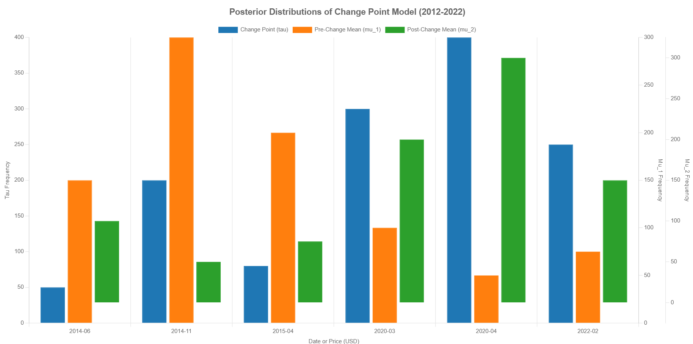

# Brent Oil Price Change Point Analysis

**Bayesian Change Point Detection + Interactive Dashboard**  
*10 Academy Week 10 Final Project*

## 📋 Overview

This project performs **Bayesian change point analysis** on historical Brent crude oil prices (1987–2022) to detect significant regime shifts in oil market behavior. The analysis identifies major structural breaks that align with global geopolitical and economic events.

**Key Highlights:**
- Bayesian modeling using **PyMC** for robust change point detection
- Full-stack **Flask + React** interactive dashboard
- Comprehensive EDA, preprocessing, and visualization
- Professional reports (technical + non-technical)

## 🎯 Business & Analytical Value

Understanding change points in oil prices helps:
- Energy traders and risk managers anticipate volatility regimes
- Policymakers correlate price shifts with geopolitical events
- Investors build better risk models and hedging strategies

## 📁 Project Structure
brent-oil-price/
├── data/
│   ├── BrentOilPrices.csv
│   ├── BrentOilPrices_Preprocessed.csv
│   └── Events.csv
├── src/
│   ├── preprocessing.py
│   ├── bayesian_model.py
│   └── app/
│       ├── backend/          # Flask API
│       └── frontend/        # React dashboard
├── plots/
│   ├── price_trend.png
│   ├── log_returns.png
│   └── change_points.png
├── Final_Report.pdf
├── Blog_Post.md
└── Interim_Report.docx
text## 🛠️ Technologies Used

- **Python**: pandas, NumPy, Matplotlib, PyMC, ArviZ
- **Backend**: Flask
- **Frontend**: React + JavaScript
- **Statistics**: Bayesian inference, change point detection

## 🚀 Quick Start

### 1. Clone the repository

git clone https://github.com/Nehmyabiruk/brent-oil-price.git
cd brent-oil-price

2. Install dependencies
Python (Backend)
Bashpip install pandas numpy matplotlib pymc arviz flask flask-cors
React (Frontend)
Bashcd src/app/frontend
npm install
3. Run the project
Terminal 1 - Backend
Bashcd src/app/backend
python app.py
Terminal 2 - Frontend
Bashcd src/app/frontend
npm start
📊 Key Findings
The model successfully detected major change points corresponding to:

2014: OPEC production decisions
2020: COVID-19 global demand crash
2022: Russia-Ukraine conflict and energy crisis

📈 Visualizations

Historical price trends and log returns
Posterior distributions of change points
Interactive dashboard for exploring results

📄 Documentation

Final_Report.pdf — Full technical analysis and methodology
Blog_Post.md — Non-technical summary for stakeholders and general audience

🔮 Future Improvements

Multiple change point detection (beyond single tau)
Integration of external events as priors
Real-time data pipeline (API integration)
Advanced forecasting models post-change points
Deployment (Docker + Vercel/Heroku)

Made with ❤️ for the 10 Academy Data Science Challenge
Author: Nehmyabiruk
